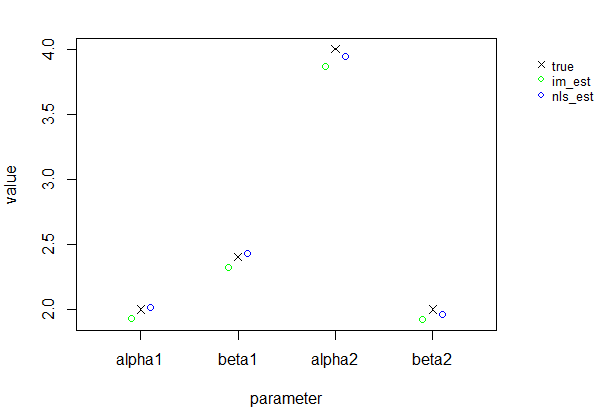
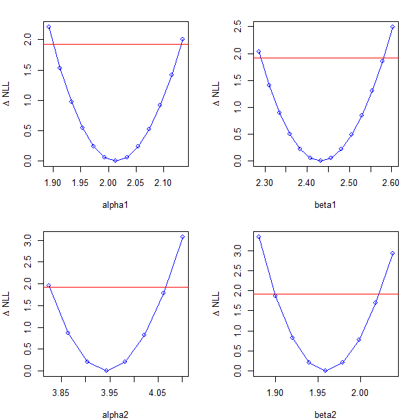

# Summary

Systems of ordinary differential equations (ODEs) are commonly used for mathematical modeling of the rate of change of dynamic processes in areas such as mathematical biology [@edelstein2005mathematical], biochemistry [@voit2000computational] and compartmental models in epidemiology [@anderson1992infectious], to mention a few. Inference of ODEs involves the 'standard' statistical problems such as studying the identifiability of a model, estimating model parameters, predicting future states of the system, testing hypotheses, and choosing the 'best' model. However, dynamical systems are typically very complex: nonlinear, high dimensional and only partialy measured. Moreover, data may be sparse and noisy. Thus, statistical learning (inference, prediction) of dynamical systems is not a trivial task in practice. In particular, numerical application of standard estimators, like maximum-likelihood or least-squares, may be difficult or computationally costly. It typically requires solving the system numerically for a large set of potential parameters values, and choosing the optimal values using some nonlinear optimization technique. Starting from a random initial guess, the optimization can take a long time to converge to the optimal solution. Furthermore, there is no guarantee the optimization will converge to the optimal solution at all.   

``simode`` is an R package for conducting statistical inference for ordinary differential equations that aims to ease the optimization process and provide more robust solutions to parameter estimation problems. The package implements a 'two-stage' approach. In the first stage, fast estimates of the ODEs' parameters are calculated by way of minimization of an integral criterion function while taking into account separability of parameters and equations (if such a mathematical feature exists). In the second stage, a regular nonlinear least-squares optimization is performed starting from the estimates obtained in the first stage, in order to try and improve these estimates.

The statistical methodologies applied in the package are based on recent publications that study theoretical and applied aspects of smoothing methods in the context of ordinary differential equations [@dattner2015; @dattner2015model; @dattner2017modelling; @yaarietal18; @dattnergugushvili18]. In that sense ``simode`` is close in spirit to the ``CollocInfer`` R package of [@hooker2015collocinfer] and the ``episode`` R package of [@mikkelsen2017learning]. Unlike ``CollocInfer``, ``simode`` does not involve penalized estimation but focuses on integral-matching criterion functions instead. Unlike ``episode`` that also uses integral-matching criteria, ``simode`` uses a minimization procedure that takes advantage of the mathematical structure of the ODEs (i.e., separability of parameters from equations).

# Statistical Methodology

A system of ODEs is given by 
$$(1) \quad x^{\prime}(t)= F(x(t);\theta),\ t\in[0,T], x(0)=\xi$$
where $x(t)$ takes values in $R^d,\, \xi$ in $\Xi\subset R^d,$ and $\theta$ in $\Theta\subset R^p$. Let $x(t;\theta,\xi), t \in [0, T ]$ be the solution of the initial value problem (1) given values of $\xi$ and $\theta$. We assume measurements of $x$ are collected at discrete time points
$$(2) \quad Y_{j}(t_i)=x_j(t_i; \theta,\xi)+\epsilon_{ij}, \quad i=1,\ldots,n j=1,\ldots,d$$
where the random variables $\epsilon_{ij}$ are independent
measurement errors (not necessarily Gaussian) with zero mean and finite variance. By integration, equation (1) yields the system of integral equations
$$(3) \quad x(t)=\xi + \int_0^t F( x(s);\theta)\, ds\,\ t\in[0,T].$$
Here $x(t)=x(t;\theta,\xi)$ is the true solution of the ODE. Let $\hat{x}(t)$ stand for a nonparametric estimator (e.g., smoothing the data using splines or local polynomials) of $x$ given the observations (2). The criterion function of an integral-matching approach for a fully observed systems of ODEs takes the form
$$(4) \quad \int_0^T\parallel\hat{x}(t)-\zeta - \int_0^t F( \hat x(s);\eta)\, ds\parallel^2 dt$$
where $\parallel \cdot \parallel$ denotes the standard Euclidean norm. The estimator of the parameter will be the minimizer of the criterion function (3), with respect to $\zeta$ and $\eta$. As its name suggests, integral-matching avoids the estimation of derivatives of the solution $x$ as done in other smooth and match applications and hence is more stable [@dattner2015]. 

The ``simode`` package is especially useful for a class of ODE systems that are linear in the parameters $\theta$, which means the system can be expressed as 
$$(5) \quad F(x(t);\theta)=g(x(t))\theta$$
This ODE system is separable in the linear parameter vector $\theta$.
In this case, minimizing the integral criterion function (4) with respect
to $\zeta$ and $\eta$ results in the direct estimators
$$(6) \quad \hat{\xi}=\left(TI_d - \hat{A} \hat{B}^{-1} \hat{A}^\top\right)^{-1} \int_0^T \left(I_d -\hat{A}\hat{B}^{-1}\hat{G}^\top(t)\right) \hat{x}(t)\,dt,$$
$$(7) \quad \hat{\theta}=\hat{B}^{-1} \int_0^T \hat{G}^\top(t) \left(\hat{x}(t) -\hat{\xi} \right) dt$$
where $I_d$ denotes the $d \times d$ identity matrix and where
$$\hat{G}(t)=\int_0^t g(\hat{x}(s))\,ds\,,\quad t \in [0,T],\nonumber \\
\hat{A}=\int_0^T \hat{G}(t)\,dt, \\
\hat{B}=\int_0^T \hat{G}^\top(t) \hat{G}(t)\,dt. \nonumber$$
Therefore, in this case, the complex task of nonlinear optimization reduces to the least squares solutions (6) and (7) which can be calculated directly, leading to a substantial computational improvement. An ODE system can also be semi-linear in the parameters, meaning that some of the parameters are separable and some are not. Formally, this can be described as
$$(8) \quad F(x(t);\theta)=g(x(t);\theta_{NL})\theta_{L}$$
where $\theta_{NL}$ are the nonlinear parameters and $\theta_{L}$ are the linear parameters. In this case, the first stage of inference using ``simode`` will involve minimization of the integral criterion function (4), where the nonlinear parameters are obtained using nonlinear optimization and the linear parameters are calculated directly using solutions (6) and (7) given the estimates of the nonlinear parameters at each iteration of the optimization. If the ODE system has no separable parameters, the first stage of inference using ``simode`` will simply perform minimization of the integral criterion function (4) using nonlinear optimization. 
It is not mandatory for the user of the package to know which parameters are linear and which are not. By default, all parameters are assumed to be linear. If this is not the case, the user will be notified which parameters should be set as nonlinear. This feature makes it very useful for handling ODEs with linear features in case the mathematical knowledge for characterizing them is lacking.

# Additional Features
``simode`` implements several features supporting various modeling setups and requirements, including: 

  * external input functions - inference of systems that employ external time-related data or function.
  * user-defined likelihood functions - inference using a user-defined likelihood function.
  * partially observed systems - inference of partially observed systems is supported when the unobserved variables can be reconstructed using estimates of the system parameters.
  * multiple subjects - inference using observations of multiple subjects (experiments), where some parameters are assumed to be the same for all subjects while other parameters are specific to an individual subject.
  * system decoupling - estimation of each equation's parameters separately using data smoothing to replace variables appearing in that equation. As [@voit2004decoupling] have shown, this may lead to better reconstruction of the underlying dynamic system.
  * parallel Monte-Carlo simulations - fitting in parallel sets of observations from Monte Carlo simulations. 
  * confidence intervals - calculation of confidence intervals for the parameters estimates using profile likelihood. 


# Example

Consider the following simple biochemical system taken from Chapter 2, Page 54 of [@voit2000computational]:
$$
(9) \quad
\begin{array}{l}
x_1^{\prime}(t)=2x_2(t)-2.4x_1(t)^{0.5},
\\
x_2^{\prime}(t)=4x_1(t)^{0.1}-2x_2(t)
\end{array}
$$


This system is a special case of an S-system [@voit2000computational] defined as

$$
x^\prime_j(t)=\alpha_j\Pi_{k=1}^dx_k^{g_{jk}}(t)-\beta_j\Pi_{k=1}^dx_k^{h_{jk}}(t), \quad j=1,\dots,d.
$$
Here, $\alpha_j,\beta_j$ are rate constants and $g_{jk},h_{jk}$ are kinetic orders that reflect the strength and directionality of the effect a variable has on a given influx or efflux. The system is linear in $\alpha_j,\beta_j$ but nonlinear in $g_{jk},h_{jk}$. For example, (9) can be written in the form of (8), as:
$$
\left(
\begin{array}{c}
x^\prime_1(t)
\\
x^\prime_2(t)
\end{array}
\right)
=
\left(
\begin{array}{cccc}
x_1^{g_{11}}(t)x_2^{g_{12}}(t),-x_1^{h_{11}}(t)x_2^{h_{12}}(t)
\\
x_1^{g_{21}}(t)x_2^{g_{22}}(t),-x_1^{h_{21}}(t)x_2^{h_{22}}(t)
\end{array}
\right)\theta_L,
$$
where $\theta_L=(\alpha_1,\beta_1,\alpha_2,\beta_2)^\top=(2,2.4,4,2)^\top$ and  
$\theta_{NL}=(g_{11},g_{12},h_{11},h_{12},g_{21},g_{22},h_{21},h_{22})^\top=(0,1,0.5,0,0.1,0,0,1)^\top$.

Here we demonstrate how to define this system symbolically, in order to be used with ``simode``:

```
R> pars <- c('alpha1','g12','beta1','h11', 'alpha2','g21','beta2','h22')
R> vars <- paste0('x', 1:2)
R> eq1 <- 'alpha1*(x2^g12)-beta1*(x1^h11)'
R> eq2 <- 'alpha2*(x1^g21)-beta2*(x2^h22)'
R> equations <- c(eq1,eq2)
R> names(equations) <- vars
R> theta <- c(2,1,2.4,0.5,4,0.1,2,1)
R> names(theta) <- pars
R> x0 <- c(2,0.1)
R> names(x0) <- vars
```

The following code solves the model and generates observations according to the statistical model defined in equation (2), where the distribution of the measurement error is Gaussian with standard deviation of $0.05$. It uses 'solve\_ode' in ``simode`` that wraps the 'ode' function of ``deSolve`` package [@deSolve] and accepts symbolic objects:
```
R> library("simode")
R> set.seed(1000)
R> n <- 50
R> time <- seq(0,10,length.out=n)
R> model_out <- solve_ode(equations,theta,x0,time)
R> x_det <- model_out[,vars]
R> sigma <- 0.05
R> obs <- list()
R> for(i in 1:length(vars)) {
+    obs[[i]] <- x_det[,i] + rnorm(n,0,sigma)
+  }
R> names(obs) <- vars
```

Now that we have setup the system of ODEs in a symbolic form and generated observations from the statistical model, we can use the ``simode`` package to estimate model parameters, plot model fits, and provide confidence intervals. For simplicity we begin by assuming that the initial conditions and the kinetic parameters are all known, so that our goal is to estimate the vector $\theta_L=(\alpha_1,\beta_1,\alpha_2,\beta_2)^\top$. The code for doing so is:

```
R> lin_pars <- c('alpha1','beta1','alpha2','beta2')
R> nlin_pars <- setdiff(pars,lin_pars)
R> est_lin <- simode(equations=equations, pars=lin_pars, 
+                    fixed=c(x0,theta[nlin_pars]), time=time, obs=obs)
R> summary(est_lin)

call:
simode(equations = equations, pars = lin_pars, time = time, obs = obs, 
    fixed = c(x0, theta[nlin_pars]))

equations:
                            x1                             x2 
"alpha1*(x2^1)-beta1*(x1^0.5)" "alpha2*(x1^0.1)-beta2*(x2^1)" 

initial conditions:
 x1  x2 
2.0 0.1 

parameter estimates:
     par   type im_est nls_est
1 alpha1 linear  1.932   2.013
2  beta1 linear  2.324   2.432
3 alpha2 linear  3.868   3.943
4  beta2 linear  1.923   1.959

im-method:  separable 

im-loss:  0.1492 

nls-loss:  0.2398 
```
The call to 'simode' returns an object of class ``simode``, containing the parameters estimates obtained using integral-matching (im_est) as well as those obtained using nonlinear least-squares  optimization starting from the integral-matching estimates (nls_est). An implementation of the generic plot function for ``simode`` objects can be used to plot the fits obtained using these estimates (Figure 1). In this case, it is also possible to plot the fit against the true curves, since the true values of the parameters that were used to generate the observations are known. 

```
R> plot(est_lin, type='fit', pars_true=theta[lin_pars], 
+       mfrow=c(1,2), legend=TRUE)
```


The same plot function can also be used to show the obtained estimates (Figure 2):
```
R> plot(est_lin, type='est', show='both', 
+       pars_true=theta[lin_pars], legend=TRUE)
```

{ width=65% }

Now we can generate confidence intervals for the parameters using profile likelihood. In case nonlinear optimization for the point estimates was used, then the profiling is done using a Gaussian based likelihood with fixed sigma which we estimate in the background.

```
R> step_size <- 0.01*est_lin$nls_pars_est
R> profile_lin <- profile(est_lin,step_size=step_size,max_steps=50)
R> confint(profile_lin,level=0.95)

call:
confint.profile.simode(object = profile_lin, level = 0.95)
level:
0.95 
intervals:
     par  nls_est    lower    upper
1 alpha1 2.013303 1.901046 2.130440
2  beta1 2.432117 2.290981 2.581607
3 alpha2 3.942877 3.825985 4.065744
4  beta2 1.959493 1.899323 2.021247
```

We can also plot the obtained likelihood profiles (Figure 3):

```
R> plot(profile_lin, mfrow=c(2,2))
```

{ width=60% }

Now let us assume the nonlinear parameters $\theta_{NL}=(g_{12},h_{11},g_{21},h_{22})$ are not known. Estimating nonlinear parameters requires nonlinear optimization. The function 'simode' uses the 'optim' function for that, thus we need to provide initial guess values for optimization. In this example, we generate random initial guess values in the vicinity of the true nonlinear parameters. The code and estimation results are given below.

```
R> nlin_init <- rnorm(length(theta[nlin_pars]),theta[nlin_pars],
+                      0.1*theta[nlin_pars])
R> names(nlin_init) <- nlin_pars
R> est_semilin <- simode(
+    equations=equations, pars=pars, fixed=x0, time=time, obs=obs,
+    nlin_pars=nlin_pars, start=nlin_init)
R> summary(est_semilin)

call:
simode(equations = equations, pars = pars, time = time, obs = obs, 
    nlin_pars = nlin_pars, fixed = x0, start = nlin_init)

equations:
                              x1                               x2 
"alpha1*(x2^g12)-beta1*(x1^h11)" "alpha2*(x1^g21)-beta2*(x2^h22)" 

initial conditions:
 x1  x2 
2.0 0.1 

parameter estimates:
     par       type      start im_est nls_est
1 alpha1     linear         NA 1.8740  2.0580
2    g12 non-linear 0.86305878 1.0040  0.9637
3  beta1     linear         NA 2.2270  2.4490
4    h11 non-linear 0.50815084 0.5136  0.4877
5 alpha2     linear         NA 3.5260  3.6870
6    g21 non-linear 0.09886774 0.1057  0.1019
7  beta2     linear         NA 1.5840  1.7160
8    h22 non-linear 1.08597553 1.1330  1.0840

im-method:  separable 

im-loss:  0.1142 

nls-loss:  0.239 
```
More examples of usages of ``simode``, including examples with Lotka-Volterra,
FitzHugh-Nagumo spike potential equations and SIR (Susceptible-Infected-Recovered) 
systems, can be found in the package demos and the package manual [@simode].

# References
